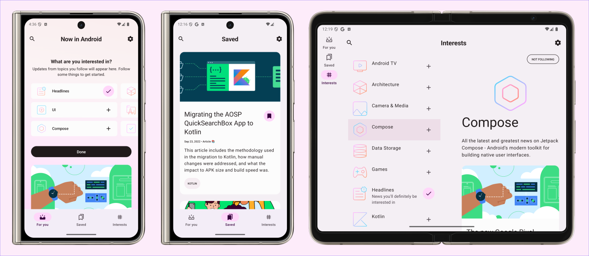

# 1일차
NIA는 크게 `ForYou`, `Saved`, `Interests` 3개의 화면으로 구성된 어플이다.
각 화면의 이동은 하단 네비게이션 바를 통해 이동되므로 가장 먼저 이를 구현하고자 했다.

하단 네비게이션을 구현하기 위해 Android Developers에서 제공하는 [Navigation](https://developer.android.com/develop/ui/compose/navigation)을 참고하여 구현하려 했으나
버전이 다르고 약간 이해가 되지 않는 부분들도 많아 영상 강의의 도움을 받았다.

https://www.youtube.com/watch?v=c8XP_Ee7iqY
이 영상의 방법대로 구현하였다.
https://youtu.be/O9csfKW3dZ4?si=mEvnn6wt3pXyn48N
https://youtu.be/AIC_OFQ1r3k?si=FxsOGCqQZMmr7KGi

3번째 영상에서 Type-Safe한 Navigation을 참고해서 구현하려 하였으나
NIA는 bottomN
```kotlin
Scaffold(
            bottomBar = {
                NavigationBar {
                    items.forEachIndexed { index, item ->
                        NavigationBarItem(
                            selected = selectedItemIndex == index,
                            onClick = {
                                selectedItemIndex = index
                            },
                            label = {
                                Text(text = item.title)
                            },
                            icon = {
                                Icon(
                                    imageVector = if (index == selectedItemIndex) item.selectedIcon else item.unselectedIcon,
                                    contentDescription = item.title
                                )
                            }
                        )
                    }
                }
            }
```
위의 코드에서 사용한 NavigationBar를 이용해서 구현한 것과 유사하게 되어 있었고

나도 이를 이용해서 구현하려 했으나 Type-Safe에서 KClass를 이용한 `composable<ScreenName>`과 같은 형태는 
```kotlin
data class NavigationItem(
    val title : String,
    val selectedIcon : ImageVector,
    val unselectedIcon : ImageVector
)
```
이와 같은 data class로 네비게이션 아이템을 구분할 때 각 `title`을 각각의 KClass로 해주어야 하는데 이 경우 모두 동일한 타입으로 해버리면
`composable`에서의 화면 구분을 할 수 없었다.
결국 각 화면을 다른 `object`로 구현해주어야 하는데 이를 서로 다르게 해줄 방법을 못 찾았다.
이후에 다시 리팩토링할 때나 차후 구현해나가며 개선해보려 한다.

# 구현 모습
