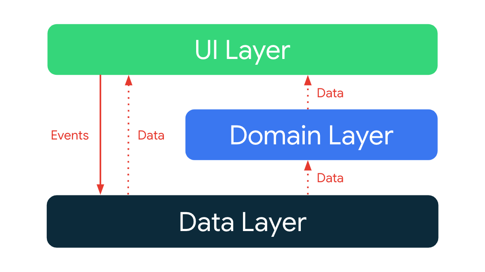
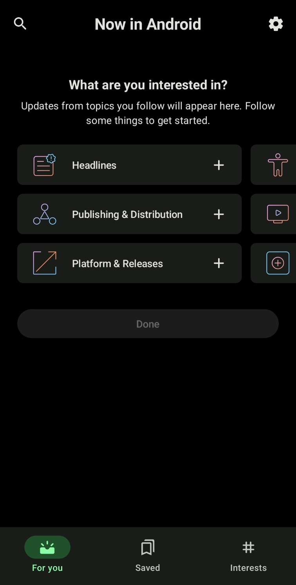

# 2일차
1일차의 코드를 검토하던 중 네비게이션을 `Scaffold`의 `bottomBar`를 통해 구현하였는데
이떄 'Scaffold' 내부의 'innerPadding'이 거슬려서 없앨 수 있을까 방법을 찾아보고 있었다.

Android Developers의 Scaffold 문서에는 `innerPadding`에 대한 설명이 별도로 존재하지 않았고
이에 `innerPadding`의 용도를 찾아보니 
> `innerPadding`은 Scaffold에서 `topBar`나 `bottomBar`와 같은 UI 요소들이 화면에 배치되었을 때
해당 요소들과 메인 콘텐츠(Body content)가 겹쳐지지 않도록 적절하게 배치하는 것을 도와주는 패딩 값을 제공한다

라는 설명을 찾아볼 수 있었다.    
필요없는 값이라 생각했었는데 화면 구성에 필수적인 부분인 것을 보고 냅두기로 했다.

## ForYou 구현
NIA는

와 같은 [Android Developers에서 제안하는 아키텍처 패턴](https://developer.android.com/topic/architecture)을 사용하여 클린 아키텍처와 비슷하지만 약간은 다른 아키텍처 구조를 가지고 있다.

그렇기에 NIA 깃허브를 보면 명칭이 클린 아키텍처와 동일하여 혼동이 올 수 있다는 내용으로 토론이 있었다.
결론은 클린 아키텍처는 좋은 아키텍처 패턴이지만 대부분의 앱은 클린 아키텍처를 적용할만큼 규모가 크지 않고
그럴 경우 Android Developers에서 제안하는 위의 아키텍처 패턴이 보다 적합하다고 한다.  

최대한 이와 같은 구조로 구현하려 한다.   
가장 먼저 `ForYou` 화면을 구현해보자.

|  |  |
|-------------------------|-------------------------|

`ForYou`는 topBar와 bottomBar 그리고 body content로 구성되어 있고   
맨처음 interests를 고르면 해당 주제의 News 목록이 나오고 해당 News를 선택시 News의 url주소로 이동한다.   
News의 최종 데이터 흐름은 다음과 같다.   

Firebase -> Repository -> UseCase -> ViewModel -> View 

News는 Firebase에 저장되어 있고 이를 불러오는 형식으로 구현되어 있다.    
사용자의 interests 정보도 파이어베이스에 저장하는 방법도 있으나 `Room`을 익히는 측면에서도 그렇고   
사용자의 interests 정보를 구분하기 위한 사용자 키와 이롤 통해 사용자별 값을 저장하는 비용 등을 고려했을 때   
interests 정보는 로컬에 저장하는 것이 보다 효율적일 것으로 판단하여 `Room`을 이용해 로컬에 저장하고자 한다.   

먼저 흐름을 다음과 같이 설계했다.   

1. 유저가 Interest 선택
2. 해당 값을 Room을 이용한 로컬 저장소에 저장
3. Repository가 저장된 값을 가져옴
4. Usecase에서 Interest가 유무 파악 
   1. 없을 경우 Interest 선택 메뉴를 화면에 출력
   2. 있을 경우 해당 Interest에 속하는 News만 선별하여 ViewModel로 전달
5. ViewModel은 해당 News 목록을 관리하고 View에 전달
6. View에서 News 목록 출력

구현하기전 아키텍처 구조를 먼저 설계하였고 이 과정에서 생긴 의문과 해결 방법들은 다음과 같다.   
+ Hilt는 왜 쓰는가?  
https://velog.io/@couch_potato/Android-Hilt%EB%A5%BC-%EC%99%9C-%EC%93%B8%EA%B9%8C

