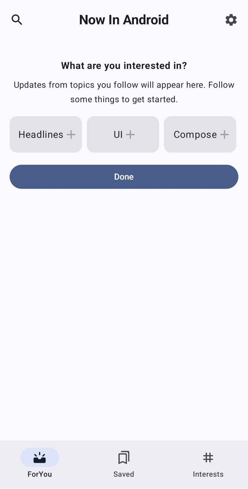

# 3일차
아키텍처 구조를 미리 설계하고 Room에서 데이터를 받아오는 구조를 먼저 구현하고 있었으나
생각해보니 테스트하기가 조금 마땅치 않았다.

그래서 구현 순서를 미리 정하고 다시 진행하기로 했다.

1. Interest 선택 및 저장
2. Interest 유무에 따른 선택버튼 출력
3. FireStore 연동
4. 임시 값 저장 후 News 가져와서 Interest에 따른 필터링
5. 필터링된 News 출력

## Interest 선택 및 저장
가장 먼저 TopBar를 먼저 구현해주었다.
```kotlin
@OptIn(ExperimentalMaterial3Api::class)
@Composable
fun TopBar(
    title: String,
) {
    CenterAlignedTopAppBar(
        title = { Text(text = title, fontWeight = FontWeight.Bold) },
        navigationIcon = {
            IconButton(onClick = { /* 검색 동작 처리 */ }) {
                Icon(
                    imageVector = Icons.Outlined.Search,
                    contentDescription = "Search"
                )
            }
        },
        actions = {
            IconButton(onClick = { /* 설정 동작 처리 */ }) {
                Icon(
                    imageVector = Icons.Filled.Settings,
                    contentDescription = "Settings"
                )
            }
        }
    )
}
```
`TopBar`는 모든 화면에서 사용하니 `BottomNavHost`에서 `bottomBar`로 네비게이션 바를 사용했으니 topBar로 `TopBar`를 사용하는 방식으로 구현하려 했다.
왜 굳이 `navigatinonIcon` 따로 `actions` 두었을까 확인해보니   
`TopAppBar` 자체가

+---------------------------------------+   
| (navigationIcon)   title    (actions) |   
+---------------------------------------+

위와 같은 구조이기에 그렇다고 한다.

ForYou에서 가장 중요한 것은 Interests가 없을 때는 Interests 선택이 나오고 Interests가 있다면 News가 나오도록 해주는 것이다.
여기서 조금 난감한 부분은 Interests 선택은 `LazyRow`처럼 좌우로 스크롤이 되고 이후 같은 위치에 나오는 News는 `LazyColumn`처럼 또 스크롤이 된다는 것이다.
내가 알기론 Lazy안에 Lazy를 넣을 수가 없다.   
지금 아이디어로는 `LazyColumn`내부에 item으로 `LazyRow`를 넣고 이후에 interests의 유무로 추가하는 방식을 수행해보는 뱡향으로 진행해보려한다.

```kotlin
item {
            Column(
                modifier = Modifier
                    .fillMaxSize()
                    .padding(16.dp),
                horizontalAlignment = Alignment.CenterHorizontally
            ) {
                Text(
                    text = "What are you interested in?",
                    fontWeight = FontWeight.Bold,
                    modifier = Modifier.padding(bottom = 8.dp, top = 16.dp),
                )
                Text(
                    text = "Updates from topics you follow will appear here. Follow some things to get started.",
                    textAlign = TextAlign.Center,
                    fontSize = 14.sp,
                    modifier = Modifier.padding(bottom = 16.dp)
                )

                LazyRow(horizontalArrangement = Arrangement.spacedBy(8.dp)) {
                    items(interests) { interest ->
                        InterestItem(
                            interest = interest,
                            isSelected = selectedInterests.contains(interest),
                            onClick = {
                                if (selectedInterests.contains(interest)) {
                                    selectedInterests.remove(interest)
                                } else {
                                    selectedInterests.add(interest)
                                }
                            }
                        )
                    }
                }

                Button(
                    onClick = { /* Handle Done action */ },
                    modifier = Modifier
                        .fillMaxWidth()
                        .padding(top = 16.dp)
                ) {
                    Text("Done")
                }
            }
        }
```
이것을 item으로 `LazyColumn`에 넣는 방식으로 구현하였다.   
이후 interests의 유무에 따라 이것을 item으로 넣을지를 정해주면 될 것같다.   
최대한 UI를 유사하게 해보려했으나 아직까지 3개씩 드래그되는 방식을 어떻게 해야할 지 감이 오질 않는다.   
일단 기능을 구현 후 다시 시도해보아야할 듯 하다.   

`Room`을 통해 저장하는 데이터를 `StateFlow`로 받아오려 했으나 이걸 써보지 않아 어려움이 있었다.
```kotlin
val savedInterests: StateFlow<List<UserInterest>> =
    userDataRepository.getInterests().stateIn(
        scope = viewModelScope,
        started = SharingStarted.Lazily,
        initialValue = emptyList()
    )
```

이렇게 `ForYouViewModel`에서 값을 가져오는데 위 코드의 의미는 다음과 같다.   
`.stateIn()` : Flow를 StateFlow로 변환   
`scope = viewModelScope` : `viewModelScope`는 ViewModel의 lifecycle에 맞춰 Coroutine을 실행하는 Scope로 `StateFlow`는 ViewModel이 소멸될 때 함께 취소됨   
`initialValue = emptyList()` : 초기값, `StateFlow`는 `LiveData`와 달리 반드시 초기값을 설정해주어야 한다.    

```kotlin
val savedInterests by viewModel.savedInterests.collectAsState()
```
`ForYouView`에서 viewModel의 savedInterests값을 받아오고 이것에 따라
```kotlin
if (savedInterests.isEmpty())
            item {
                InterestSelectContent(viewModel)
            }
```
`LazyColumn` 내부에 Interest 선택 UI를 item으로 넣어줄지 결정하면 1번과 2번이 완성된다.   
제거는 Interests 부분에서 구현할 예정이다.

   
임시 값으로 Interest는 몇개만 넣었고 각 Interet 별 이미지는 `InterestItem`으로 별도로 만들어서 관리해야할 것 같다.