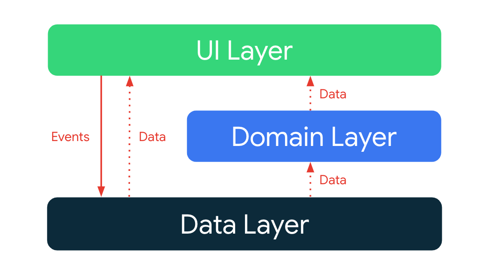

# 4일차

3일차에서 정한 개발단계 순서대로 오늘은 Firebase 연동을 할 것이다.

제일 먼저 Firebase에 저장할 News가 가질 값들을 정의하는 것이다.   
NIA를 보면 이미지, 제목, 날짜, 종류, 본문내용, 분야가 나와있고 해당 News를 터치하면 해당 URL로 이동한다.   
그러므로 News는 최종적으로 이런 형태로 저장될 것이다,
```
News(
    ImageURL,
    Name,
    Date,
    NewsType,
    Detail,
    Interest
    NewsURL
)
```

물론 완전 똑같은 News를 다 가져오지는 않고 테스트 데이터로만 넣어서 만들 생각이다.

구현 중 `ForYouViewModel`이 Repository들을 Usecase를 거치지 않고 바로 참조하고 있었는데   
기능상으로는 별 차이가 없고 실제 구현에서도 ViewModel에서 데이터 처리를 해도 그리 무거워지지 않아 별 상관이 없지만   
아키텍처 패턴을 익히기 위함과 조금이라도 결합도를 낮추고자 Usecase를 의존화도록 수정했다.



최종적으로 위의 구조를 최대한 따르고자 UI Layer에서 Interests를 추가 및 제거하는 것은   
Data Layer에게 직접 Events를 전달하고 저장소에서부터 받아온 데이터를 UI Layer에서 사용하는 것은 Domain Layer를 거치도록 구현할 것이다.

## UseCase 구현
가장 먼저 사용자가 고른 Interests들로 뉴스들을 필터링해야한다.
`NewsRepository`와 `UserDataRepository`로부터 받아온 `List<News>`Flow와 `<List<Interest>`Flow를 결합하여   
사용자의 Interest인 News들만으로 구성된 새로운 Flow를 `ForYouViewModel`로 보내주어야 한다.

```kotlin
private fun Flow<List<News>>.mapToUserSearchResult(userInterests: Flow<List<UserInterest>>): Flow<List<News>> =
    combine(userInterests) { newsList, userInterestsList ->
        val interests = userInterestsList.map { it.interest }
        newsList.filter { news ->
            news.interest.any { it in interests }
        }
    }
```
 
`combine()` : 괄호안의 Flow와 기존의 Flow를 결합하여 두 Flow에서 값이 발생할 때마다 람다함수 내부가 실행된다.   

## NewsContent 구현
이제 `ForYouView`에서 보여지는 News를 만들어야 한다.   
처음에는 `Card`를 이용해서 구현하려고 하였으나 보다 좋은 방법이 있을까 찾아보다가
`Box`와 `Surface`라는 대안이 있었다.
   
GPT는 각각을 이렇게 비교하였으나 제대로 와닿지 않는 느낌이다.
특히 `Surface`와 `Card`의 목적이 동일해보여 둘의 용도로서의 차이도 잘 이해가 가지 않는다.

StackOverflow에서는
> Surface is used when you want a surface for your UI, you can set the background color, shape etc.   
Card on the other hand, have default elevation(Material Design Standard) and pretty much have every property as the surface.

로 각각 목적이 다르다고 하나 이렇게 보아도 그리 잘 와닿지 않아 Material Design Guidelines을 읽어보아야 할 듯 하다.

> Usage
Cards are surfaces that display content and actions on a single topic.   
They should be easy to scan for relevant and actionable information. Elements, like text and images, should be placed on them in a way that clearly indicates hierarchy.

Material Design Guidelines를 보니 Card는 Surface의 일종으로 Surface로 구성되어 단일 목적으로 쓰이는 UI인 것 같다.
그렇기에 Surface가 더 가벼운 것으로 보인다.

그렇다면 Suface를 쓰는 것이 적합해 보인다.
