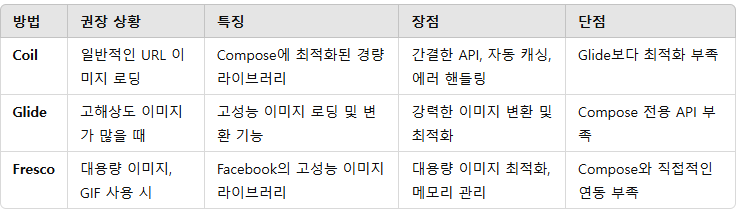

# 5일차

아직 compose로 UI를 구성하는 것이 조금 낯설어 `NewsContent` 구현이 조금 어렵다.   
`Surface` 내부를 무엇으로 어떻게 채워야하는 게 어려워 시간이 걸린다.   
오늘 목표는 `NewsContent` 구현으로 `ForYouView`에 뉴스를 띄우는 것이다.

Firebase 저장소에 URL 형식으로 이미지가 저장되어 있는데 이것을 무엇으로 받는 것이 적합한지가 첫 난관이었다.   
여러가지 방법들이 있었고 최종적으로 `Coil`, `Glide`, `Fresco` 중 고민했는데



GPT는 이렇게 비교해주었다. GPT는 `Coil`을 추천했는데 여기서 또 의문이 드는 것은 설명을 보면 `Glide`가 고해상도 처리와 성능적 우위를 갖는 것으로 보이는데 왜 `Coil`을 권장하는가 였다.
이에 대한 의문과 해결을 다음과 같이 정리하였다.

[Coil vs Glide](https://velog.io/@couch_potato/Android-Coil-vs-Glide-in-Compose)

임시값은 전부 동일한 이미지URL을 갖고 있어 `Glide`가 더 적합하지만   
실제 데이터로 이미지를 가져온다면 이미지의 종류가 많고 이 경우에는 `Coil`이 더 적합하다.   
그렇기에 실제로 가정하여 `Coil`을 사용하는 것이 적합하다고 판단하였다.   
`Coil`로 구현하기로 결정하였으니 가장 먼저 `Coil`라이브러리를 추가해준다.

```kotlin
    implementation(libs.coil.compose)
    implementation(libs.coil.network.okhttp)
```
app단위 gradle에 dependency를 추가해준다.

`newsContent`를 다음과 같이 구현하였다.
```kotlin
@Composable
fun NewsContent(news: News) {
    Surface(
        modifier = Modifier
            .fillMaxWidth()
            .padding(16.dp),
        shape = RoundedCornerShape(16.dp),
        onClick = {
            
        }
    ) {
        Column {
            AsyncImage(
                model = news.imageUrl,
                contentDescription = null
            )
            Column(
                modifier = Modifier
                    .fillMaxWidth()
                    .background(Color.DarkGray)
                    .padding(14.dp)
            ) {
                Box(
                    modifier = Modifier.fillMaxWidth()
                ) {
                    Box(
                        modifier = Modifier
                            .align(Alignment.TopEnd)
                            .padding(8.dp)
                    ) {
                        Icon(
                            imageVector = Icons.Outlined.BookmarkBorder,
                            contentDescription = null,
                            tint = Color.White
                        )
                    }
                    Text(
                        text = news.name,
                        fontSize = 30.sp,
                        color = Color.White
                    )
                }
                Text(
                    text = news.date.toDate().toString(),
                    fontSize = 12.sp,
                    color = Color.White
                )
                Text(
                    text = news.detail,
                    color = Color.White
                )
                LazyRow {
                    items(news.interest) {
                        interest ->
                        AssistChip(
                            modifier = Modifier
                                .padding(2.dp),
                            onClick ={},
                            label = {
                                Text(
                                    text = interest,
                                    fontSize = 12.sp
                                )
                             },
                            colors = AssistChipDefaults.assistChipColors(
                                containerColor = Color.Gray,
                                labelColor = Color.White
                            ),
                            border = null,
                            shape = RoundedCornerShape(16.dp)
                        )
                    }
                }
            }
        }
    }
}
```   
처음에 제목과 북마크 아이콘을 `Row`안에서 구현했으나 이 경우 아이콘이 text의 바로 옆에 붙는 현상이 발생했다.   
이것은 `Row`의 성질로 정렬하려고 하기에 그렇다. 그러나 NIA에서 북마크는 고정된 위치에 존재한다.   
그렇기에 이를 `Box`로 구현하여 독립된 공간을 보장해주었다.

색상은 이후 설정을 구현할 때 라이트/다크 모드를 구현하며 보완할 예정이다.

이제 터치시 해당 뉴스의 url로 이동하는 `onClick`을 구현해야하는데 이것을 구현하는 방법도 2가지이다.   
첫 번째는 `WebView`, 2번째는 `Chrome Custom Tabs`이다.   
두 방안을 비교하다가 StackOverflow에서 간결한 설명을 찾았다.
> If you just want to show a certain page then I would suggest you use chrome custom tabs. You can style the toolbar in a way it resembles your app style and they are intended for showing content without you having to worry much about anything else.   
> 
> if you want to have full control over what the user is doing inside this website you have to use a webview. (you can prevent the user clicking links on the webview, you could intercept data the user inputs into controls on the website...) But this can also be a negative aspect since the user really has to trust you that you don't log his data or even fiddle with it.
> 
> summary: "The WebView is good solution if you are hosting your own content inside your app. If your app directs people to URLs outside your domain, we recommend that you use Chrome Custom Tabs"

웹사이트에서의 동작을 내가 컨트롤하고자 한다면 `WebView`가 좋은 선택지이나 NIA는 실제 웹페이지로의 이동만을 제공한다.   
그렇기에 `Chrome Custom Tabs`를 사용하는 것이 적절하다고 판단된다.

구현도 정말 간단하다.
```kotlin
fun openCustomTab(context: Context, url: String) {
    val intent = CustomTabsIntent.Builder().build()
    intent.launchUrl(context, Uri.parse(url))
}
```

|  |  |
|-------------------------|-------------------------|

이렇게 하면 `ForYou`의 구현이 완료되었다.   
북마크와 색상 등은 Saved와 설정 구현때 처리할 예정

Saved는 구현이 상대적으로 쉬울 것 같아 Interests를 먼저 구현하는 것이 좋을 것 같다.
