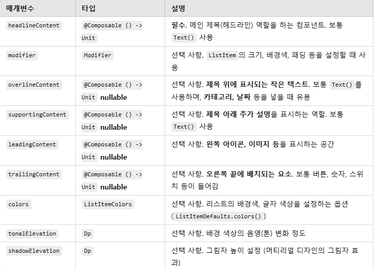
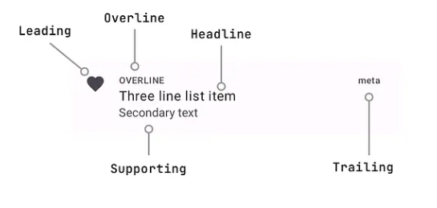

# 6일차
이번에 구현할 것은 Interests이다.   
Interests는 Interest 목록을 보여주고 `+`버튼으로 추가할 수 있고 이미 추가되어 있는 Interest를 제거할 수도 있다.

또한 각 Interest를 터치하면 해당 Interest에 대한 설명과 관련 News를 볼 수 있다.

처음에는 `InterestItem`을 `LazyColumn`으로 보여주면 간단하게 구현할 수 있겠다고 판단했다.

그런데 막상 구현하면서 `Modifier`의 동작원리에 대한 이해가 미숙하여 원하는 UI 배치가 어려웠고 주제목록들을 어디에 저장해야 하는 지에 대한 고민이 생겼다.   
처음에는 단순히 `InterestView`에 리스트로 저장해놨으나 이것이 뭔가 보기 좋지 않았다.

또한 `NewsContent`와 동일하게 `Box`를 활용해서 각각의 위치를 고정해 구현하면 수월할 것이라 생각했는데   
`Box`는 실제로 써보니 `Row`나 `Column`과 다르게 정렬이 제대로 이루어지지 않았다.   
그렇다고 padding을 직접 구체적인 수로 넣어주면 이것은 너무 내 기기에 과적합되는 것같아 옳지 않다고 판단했다.   

방법을 못 찾겠어서 NowInAndroid 코드를 살펴보니 `ListItem`이라는 것을 사용하는 것을 볼 수 있었다.

```kotlin
public fun ListItem(
    headlineContent: @Composable () -> Unit,
    modifier: Modifier = Modifier,
    overlineContent: @Composable() (() -> Unit)? = null,
    supportingContent: @Composable() (() -> Unit)? = null,
    leadingContent: @Composable() (() -> Unit)? = null,
    trailingContent: @Composable() (() -> Unit)? = null,
    colors: ListItemColors = ListItemDefaults.colors(),
    tonalElevation: Dp = ListItemDefaults.Elevation,
    shadowElevation: Dp = ListItemDefaults.Elevation
): Unit
```
위와 같은 구조로 되어 있으며 
각 구성요소에 대한 설명은 

와 같다.

   
실제 구성요소의 배치결과는 이렇게 나타난다.   
NIA의 배치와 동일하다. 그렇기에 나도 `ListItem`을 사용하기로 결정하였다.

이제 문제는 주제목록을 어떻게 저장할 지이다.   
가장 쉬운 방법은 그냥 전부 통으로 View에 list로 저장하는 것이다.   
하지만 이 방법은 속된 말로 멋이 없다. 코드가 지저분해지기도 하고   
주제 목록은 Interest와 ForYou 2군데에서 사용되니 하나의 값에서 가져올 수 있다면 보다 깔끔하게 코드를 작성할 수 있을 것이다.

선택한 방법은 **싱글톤 객체**이다.   
Topic은 개수와 종류가 변하지 않는 정적인 값이므로 ViewModel이나 다른 방법들보다 싱글톤 객체로 관리하는 것이 좋다고 판단했다. 

```kotlin
object TopicRepository {
    val interests = listOf(
        "Accessibility",
        "Android Auto",
        "Android Studio & Tools",
        "Architecture",
        "Camera & Media",
        "Compose",
        "Data Storage",
        "Games",
        "Headlines",
        "Kotlin",
        "New APIs & Libraries",
        "Performance",
        "Platform & Releases",
        "Privacy & Security",
        "Publishing & Distribution",
        "Testing",
        "UI",
        "Wear OS"
    )
}
```

이렇게 주제를 전부 넣고 하나의 객체만 사용해서 불필요한 추가 리소스를 사용하지 않고자 의도했다.   

남은 기능은 
1. `+` 버튼으로 `UserInterest` 추가 및 이미 포함되었다면 체크 아이콘으로 변경과 제거 기능으로 작동하도록 하는 것
2. listitem 터치시 해당 Topic 페이지르 이동

이다.

