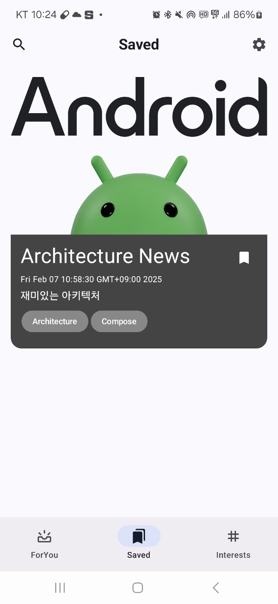

# 8일차
이제 남은 화면인 Saved의 구현을 할 차례이다.   
InterestDetail은 기존의 로직과 거의 동일하기에 Search와 Option 구현후에 추가해줄 계획이다.

## Navigation 개선
그전에 먼저 기존에는 네비게이션의 BackStackEntry의 Destination의 route값을 받아와 `contains`로 확인해주던 것을
```kotlin
val currentDestination = currentBackEntry?.destination
    LaunchedEffect(currentDestination) {
        selectedItemIndex = items.indexOfFirst { currentDestination?.hasRoute(it.route::class) == true }
            .takeIf { it != -1 } ?: 0
    }
```
`hasRoute`를 통해 현재 경로가 route의 class를 포함하는지의 여부로 확인하는 방식으로 조금더 KClass에 적합하게 수정하였다.
(고마워요 게일..ㅎㅎ)

## Saved
Saved는 ForYou에서 북마크 아이콘을 통해 저장한 뉴스를 보여주는 방식이다.   

그렇다면 `NewsContent`를 수정해주어야 한다.

<details>
  <summary>구조 설계 과정</summary>

구현 로직을 어떻게 할지를 많이 고민하였다. 로컬에 북마크 정보를 저장할 때 어떻게 해야할지를 고민 많이 했는데 그냥 `News` 자체를 저장하는 방식이 가장 나을 듯 하다.   
이렇게 할 경우 Saved의 구현이 매우 간단해진다.   
문제는 UI의 갱신이다.

저장된 정보를 어디서 받아와서 처리해야할 지가 조금 어려운 것 같다.   
북마크 정보를 Repository에서부터 받아 ViewModel로 올리고 그걸 다시 View로 올려서 `NewsContent`생성 때 넣어주는 방식만 지금 떠오르는데 뭔가 너무 과한 것 같다.

다시 생각해보니 아예 파이어베이스에 개인 뉴스 북마크 정보만 따로 저장하는 방식으로 처리하는 것이 나을 것 같다는 생각이 든다.   
그리고 전체 뉴스를 공통을 받고 개인 북마크 정보랑 가공후 bookmark boolean 처리를 해주는 방식으로 구현해준다.

그러면 기존 `News`에 `isBookmarked`를 추가해주고 이를 유스케이스에서 ViewModel로 올리기전에 처리를 수행하는 구조로 구현해볼 것이다.

순서는 다음과 같다.

1. 파이어베이스에서 뉴스 목록/북마크 뉴스목록 받아옴
2. 전체 뉴스 목록을 받아온 후 유스케이스에서


전체 뉴스에서 북마크 처리
북마크된 애들은 별도로 Saved로 보냄   
이것도 아닌 것 같다.

기존의 `NewsRepository`를 `FirebaseRepository`로 변경하고 여기서 파이어베이스로부터의 값을 담당하도록 기능을 추가해준 후   
`GetSavableUseCase`를 뉴스의 가공을 처리하는 기능을 책임지는 방향으로 구현하는 것이 보다 구조적으로 깔끔한 것 같다.

먼저 유저 구분을 위해 `FirebaseModule`에 `FirebaseAuth`싱글톤 객체를 제공하도록 추가해준다.
```kotlin
@Provides
    @Singleton
    fun provideFirebaseAuth(): FirebaseAuth = FirebaseAuth.getInstance()
```

`FirebaseRepository`에 `getBookmarks()` 함수를 추가해준다.
```kt
fun getBookmarks(): Flow<List<String>> = callbackFlow {
        val currentUserId = userId ?: run {
            close(IllegalStateException("User not authenticated"))
            return@callbackFlow
        }
        val documentRef = bookmarkCollection.document(currentUserId)
        val bookmarks = documentRef.addSnapshotListener { snapshot, error ->
            if (error != null) {
                close(error)
                return@addSnapshotListener
            }
            val bookmarkList = (snapshot?.get("bookmarkList") as? List<*>)?.filterIsInstance<String>() ?: emptyList()
            trySend(bookmarkList).isSuccess
        }
        awaitClose { bookmarks.remove() }
    }
```

또한 기존에는 `invoke()`로 단일 기능으로 사용했던 UseCase를 수정해서
```kotlin
private val newsWithBookmarks: Flow<List<News>> =
        firebaseRepository.getNews().getNewsWithBookmarks(firebaseRepository.getBookmarks())

    fun getSubscribedNews(): Flow<List<News>> =
        newsWithBookmarks.mapToUserSearchResult(userDataRepository.getInterests())

    fun getBookmarkedNews() : Flow<List<News>> =
        newsWithBookmarks.getBookmarkedNews()
```
```kotlin
private fun Flow<List<News>>.getBookmarkedNews(): Flow<List<News>> =
    transform { newsList -> emit(newsList.filter { it.isBookmarked }) }

private fun Flow<List<News>>.getNewsWithBookmarks(bookmarks: Flow<List<String>>): Flow<List<News>> =
    combine(bookmarks) { newsList, bookmarkList ->
    newsList.map { news ->
        news.copy(isBookmarked = bookmarkList.contains(news.name))
    }
}
```
메소드를 추가해주고 북마크뉴스를 반환하는 함수와 뉴스에 북마크처리를 해주는 함수를 추가해준다.

하면서 생각한건데 이건 너무 서버 낭비다.
Room을 이용해서 로컬에 저장하는 것이 더 좋은 방법으로 생각된다.
</details>

구조설계과정들에 설계 과정에서의 고민과 시도한 여러가지 방법들이 있는데 마지막 방법에서 북마크를 Room을 이용해 로컬에 저장하는 것으로 결정하였다.

```kotlin
@Database(entities = [UserInterest::class, BookmarkNews::class], version = 1, exportSchema = false)
abstract class AppDatabase : RoomDatabase() {
    abstract fun userInterestDao(): UserInterestDao

    abstract fun bookmarkDao(): BookmarkDao
}
```

`AppDatabase`에 `BookmarkDao`를 추가해주는 것 외에는 `UserInterestDao`를 구현할 때와 동일하다.

> java.lang.IllegalStateException: A migration from 1 to 2 was required but not found. Please provide the necessary Migration path via RoomDatabase.Builder.addMigration(Migration ...) or allow for destructive migrations via one of the RoomDatabase.Builder.fallbackToDestructiveMigration* methods
 
추가후 실행해보았는데 에러가 발생헀다.  
이유를 보아하니 기존에 저장하던 방식과 변경되어 버전을 마이그레이션해주어야 하는데 해주지 않았기 때문에 발생한 에러다.   
실제 서비스라면 별도의 버전 업과 기존 데이터 마이그레이션을 해주어야하는데 나는 개인적인 테스트이므로 앱 삭제후 재설치 해주면 된다.

그래도 이번 기회에 Database가 변경되면 버전을 마이그레이션해주어야 한다는 것을 배웠다.

Saved는 ForYou와 보여주는 게 같으므로 동일하게 구현

## NewsIntent
이제 `NewsIntent`에 클릭구현을 해줄 차례이다.   
가장 고민한 부분이 '저장/삭제 함수를 어떻게 집어넣을까'였다.

정말 많은 방법을 생각해보았다. 아예 별도의 `NewsIntent`용 ViewModel을 만든다던지, UseCase로 Saved와 ForYou 모두에서 사용할 수 있도록 하는 방법, Repository를 추가로 주입하는 방법, 아니면 아예 Dao랑 연결하는 방법 등등...   
이 모든 방법들이 아키텍처 패턴상 다 좋지 않아보였다.

그래서 최종적으로 선택한 방법은 View에서 ViewModel의 토글함수를 콜백함수로 넘겨주는 것으로 최대한 결합도를 낮추려고 하였다.

이것도 최고의 방법이라고 생각되지는 않는다.

```kotlin
fun toggleBookmarks(newsName: String, isBookmarked: Boolean) {
        viewModelScope.launch {
            if (isBookmarked)
                userDataRepository.deleteBookmark(newsName)
            else
                userDataRepository.addBookmark(newsName)
        }
    }
```

이 코드가 `ForYouViewModel`과 `SavedViewModel`에 똑같이 들어있어 보일러플레이트 코드라 조금 만족스럽지 않다.   
아예 BaseViewModel을 만들어 두 ViewModel이 상속받게 한후 거기서 위의 함수를 넣어줄 수도 있지만 뭔가 과한 것 같기도 하다.   

아직은 더 좋은 방법이 떠오르지 않는다. 클론앱 완성후에는 더 좋은 방법을 떠올릴 수 있는 개발자가 되어있길 바란다.   
안되면 원본 프로젝트 코드를 까보는 수 밖에..

```kotlin
                NewsContent(
                    news = news,
                    onBookmarkClicked = { name, isBookmarked ->
                        viewModel.toggleBookmarks(name, isBookmarked)
                    }
                )
```

View에서의 호출은 이렇게 수정해주었다. 이것도 두 View에서 동일하다.

마지막으로 `NewsIntent`의 북마크 Icon도 수정해준다.
```kotlin
Icon(
    modifier = Modifier
        .clickable { onBookmarkClicked(news.name, news.isBookmarked) },
    imageVector = if(news.isBookmarked) Icons.Filled.Bookmark else Icons.Outlined.BookmarkBorder,
    contentDescription = null,
    tint = Color.White
)
```
이렇게 하면 Saved까지 완성되었다.



이제 다음에 구현할 것은 설정이다.

