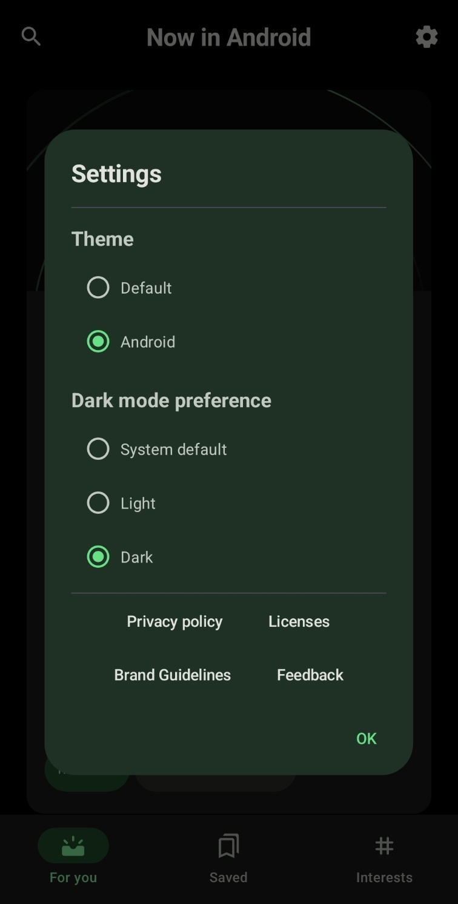
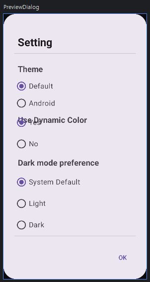

# 9일차

이제 구현할 것은 Setting으로 Setting은   
   
위와 같이 팝업의 형태로 표시된다.

이것은 `Dialog`를 이용해 구현한 것으로 보이지만 기존에 내가 알던 `Dialog`의 사용법과는 사뭇 다르다.   
기존에 사용해보았던 방식들은 단순히 알림을 표시하는 기능이나 입력 기능만을 제공하는 단순한 UI였다.

이렇게 다양한 기능과 Theme 선택시 즉각적으로 `Dialog`가 변하는 건 이번이 처음으로 조금 어려울 것 같아 기대가 된다.

시작부터 문제가 발생했다.   

`SettingDialog`를 만들어서 `AlertDialog`를 이용해서 구현을 하고자 하였는데 `SettingDialog`의 호출은 `TopBar`의 설정 아이콘의 click에서 이루어져야하므로 당연히 `onClick`에 집어넣었다. 
```kotlin
IconButton(onClick = { SettingDialog() }) {
                Icon(
                    imageVector = Icons.Filled.Settings,
                    contentDescription = "Settings"
                )
            }
```
그런데 바로 에러메시지가 떴다.
> @Composable invocations can only happen from the context of a @Composable function

Composable 함수는 Composable 함수의 context 내에서만 호출될 수 있다는 것이다.

일단 Composable함수는 Composable함수 내에서만 호출되어야한다는 것을 생각조차 안 하고 있었고 `IconButton`은 Composable함수인데 `onClick`의 람다 내부가 Composable이 아니여서 안 될줄은 몰랐다.

떠오르는 방법은 State로 Dialog 표시를 관리하고 true일 때 기존 Composable 함수 내부에서 호출해주는 것이다.   
이 방법은 늘 하면서도 뭔가 이쁘지 않은 것 같다.
그래도 이 방법을 해야할 듯 하다.

`MaterialDialog`의 `show()`를 이용한 방법도 찾아보았지만 `show()`를 이용한 방법은 화면 회전같은 Activity의 재생성 때 상태가 유지되지 않는 문제점이 있다.   
또한 내가 알기로는 `MaterialDialog`는 **Dialog가 닫힐 때 값을 적용**할 수 있는 것으로 알고 있다. 그렇기 때문에 즉각적인 피드백으로 UI가 변경되는 NIA의 Setting에는 적합하지 않다고 판단된다.

화면 회전시에도 Dialog가 표시되어야 하므로 `rememberSaveable`을 통해 상태를 기억해준다.

어려운 부분은 Dialog 내부다.   
Setting값이 바뀜에 따라 즉각적으로 테마, 다크모드가 바뀌어야 하고 Theme의 선택에 따라 Dialog에 즉각적으로 Use Dynamic Color가 새로 생긴다.

가독성을 높이기 위해 각 구성요소마다 함수를 전부 분리해주는 편이 좋을 것 같다.

```kotlin
@Composable
fun ThemeSetting() {
    val themeOptions = listOf("Default", "Android")
    val (selectedOption, onOptionSelected) = remember { mutableStateOf(themeOptions[0]) }

    Text(
        text = "Theme",
        fontSize = 18.sp,
        fontWeight = FontWeight.Bold,
        textAlign = TextAlign.Left,
        modifier = Modifier.fillMaxWidth().padding(8.dp)
    )

    Column(
        modifier = Modifier.selectableGroup()
    ) {
        themeOptions.forEach { text ->
            Row(
                Modifier
                    .fillMaxWidth()
                    .height(38.dp)
                    .selectable(
                        selected = (text == selectedOption),
                        onClick = { onOptionSelected(text) },
                        role = Role.RadioButton
                    )
                    .padding(horizontal = 4.dp),
                verticalAlignment = Alignment.CenterVertically
            ) {
                RadioButton(
                    selected = (text == selectedOption),
                    onClick = null
                )
                Text(
                    text = text,
                    style = MaterialTheme.typography.bodyLarge,
                    modifier = Modifier.padding(start = 4.dp)
                )
            }
        }
    }

    if(selectedOption == themeOptions[0]) {
        UseDynamicColor()
    }
}
```
간단한게 `selectedOption`을 통해 `UseDynamicColor`를 표시하도록 해주었다.

그런데 이렇게 하니 실제 NIA에서는 Theme의 아래에서 부드럽게 나오는데 내 코드에서는 확 나타나고 확 사라졌다.

어떻게 해야할까 방법을 찾아보니  안드로이드에서는 다양한 애니메이션을 지원하고 있다.   
[안드로이드 공식문서 애니메이션](https://developer.android.com/develop/ui/compose/animation/introduction)   
이중에서 `AnimatedVisibility`가 내가 원하는 애니메이션이므로 이것을 적용시켜준다.

```kotlin
@Composable
fun AnimatedVisibility(
    visible: Boolean,
    modifier: Modifier = Modifier,
    enter: EnterTransition = fadeIn() + expandIn(),
    exit: ExitTransition = shrinkOut() + fadeOut(),
    label: String = "AnimatedVisibility",
    content: @Composable() AnimatedVisibilityScope.() -> Unit
) {
    val transition = updateTransition(visible, label)
    AnimatedVisibilityImpl(transition, { it }, modifier, enter, exit, content = content)
}
```
`visible` : 보여지는 조건   
`enter` : 등장할 때 애니메이션   
`exit` : 사라질 때 애니메이션

```kotlin
AnimatedVisibility(
        visible = selectedOption == themeOptions[0],
        enter = fadeIn() + expandVertically(),
        exit = fadeOut() + shrinkVertically()
    ) {
        UseDynamicColor()
    }
```
이렇게 변경해주면 된다.

문제가 발생했다.



애니메이션을 적용해주니 Use Dynamic Color가 겹쳐졌다.

```kotlin
@Composable
fun DialogDetail() {
    Column {
        ThemeSetting()
        DarkModeSetting()
        HorizontalDivider()
    }
}
```
애니메이션이 적용되면서 UI요소가 재조정되지 않아서 발생하는 문제같다.    
같은 `Column` 내에서 정렬된 라디오 버튼은 안 겹쳐지지만 상위 `DialogDetail`의 `Column`에서의 정렬이 제대로 이루어지지 않는 것 같다.

찾아보니   
**애니메이션이 진행되는 동안 `Column`의 자식 요소들의 공간 차지가 동적으로 변하기 때문이라고 한다.**

그래서 아예 애니메이션으로 추가되는 부분을 별도의 `Column`으로 감싸서 사전에 미리 공간을 정의하여 정렬을 해주면 해결된다.

이렇게 하니 NIA와 동일하게 동작한다.

이제 UI 배치가 끝났으니 본격적으로 Theme과 DarkMode 처리를 해줄 차례이다.
